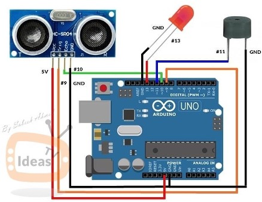

# 🦯 Smart Blind Walking Stick using Arduino

A cost-effective and functional walking stick designed to assist visually impaired individuals using Arduino and ultrasonic technology. It detects nearby obstacles and alerts the user via **buzzer**, **LED**, and **vibration motor**.

---

## 🎯 Objective

To develop a smart walking stick that can alert visually impaired individuals to nearby obstacles, helping them navigate safely and independently.

---

## 🔩 Components Used

- Arduino Uno  
- HC-SR04 Ultrasonic Sensor  
- Buzzer  
- Vibration Motor  
- LED with 220Ω resistor  
- Jumper Wires  
- PVC Pipe  
- Battery Holder & Rechargeable Battery  
- Cable Ties  

---

## ⚙️ Working Principle

The stick uses an **ultrasonic sensor** to detect obstacles up to a distance of **25 cm**. When an object is detected:

- 🔊 The buzzer beeps  
- 💡 The LED lights up  
- 🔘 The vibration motor activates *(optional, if connected)*

These alerts notify the user of nearby obstructions, helping them avoid collisions.

---

## 🔌 Circuit Diagram



---

## 💻 Arduino Code

```cpp
const int trigPin = 9;
const int echoPin = 10;
const int buzzer = 11;
const int ledPin = 13;

long duration;
int distance;
int safetyDistance;

void setup() {
  pinMode(trigPin, OUTPUT);
  pinMode(echoPin, INPUT);
  pinMode(buzzer, OUTPUT);
  pinMode(ledPin, OUTPUT);
  Serial.begin(9600);
}

void loop() {
  digitalWrite(trigPin, LOW);
  delayMicroseconds(2);
  digitalWrite(trigPin, HIGH);
  delayMicroseconds(10);
  digitalWrite(trigPin, LOW);

  duration = pulseIn(echoPin, HIGH);
  distance = duration * 0.034 / 2;
  safetyDistance = distance;

  if (safetyDistance <= 25) {
    digitalWrite(buzzer, HIGH);
    digitalWrite(ledPin, HIGH);
  } else {
    digitalWrite(buzzer, LOW);
    digitalWrite(ledPin, LOW);
  }

  Serial.print("Distance: ");
  Serial.println(distance);
}
```

---

## ✅ Result

When an obstacle is detected within 25 cm:
- 💡 The LED lights up  
- 🔊 The buzzer beeps  
- 🧠 The user is effectively alerted

If the path is clear, all alerts remain off.

---
